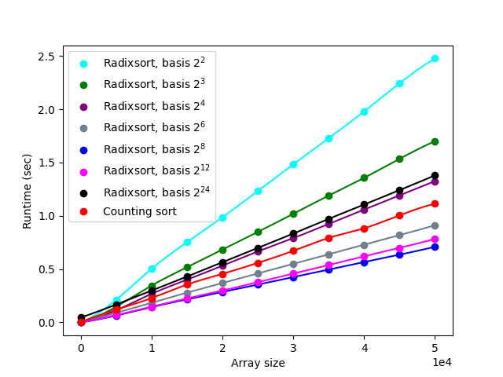
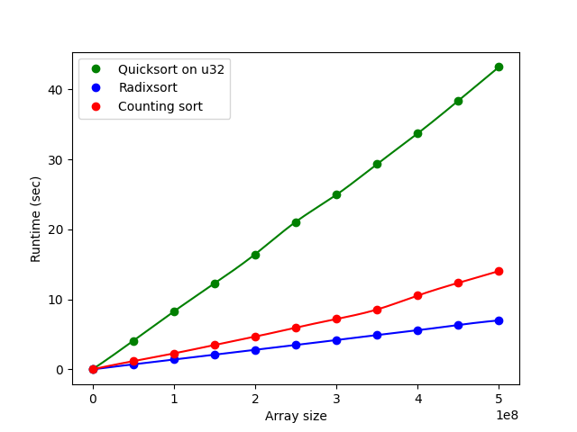

# Sorting-Algorithms
Studying sorting algorithms in C.
# Radix Sort

# Radix sort vs Quick sort

## Compile/Run
### With the wrapper
Install dependencies: `pip install -r requirements.txt`  
And run with `python wrapper.py`.  
### With make
Compile with `make`.  
Command list: `./out`.

